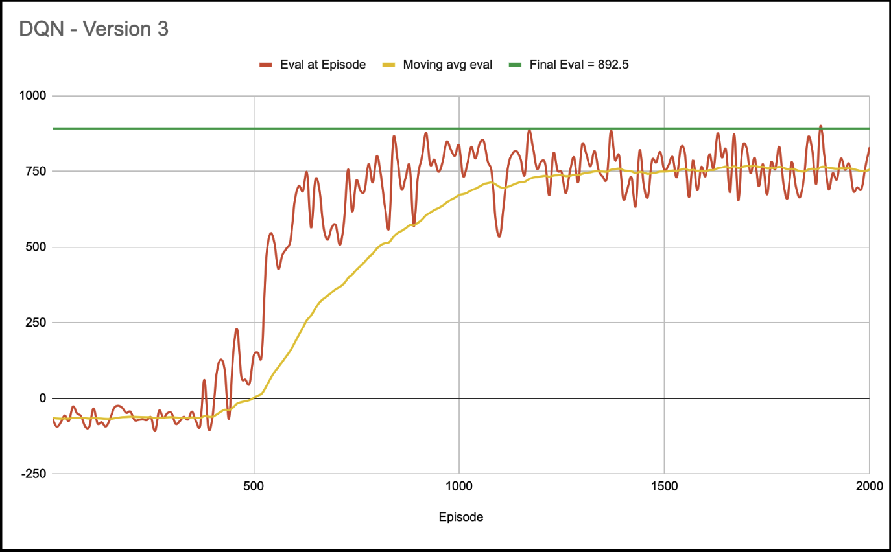

# CarRacing-v3 — DDQN Agent 🚗💨
A Reinforcement Learning project using a Double Deep Q-Network (DDQN) to learn how to drive in the Gymnasium CarRacing-v3 environment.  
The agent uses a convolutional neural network, frame-stacking, replay buffer, target network, epsilon decay, and reward shaping.

Work in progress — improving stability, adding visualizations, and refining hyperparameters.

---
<p float="left">
  
  
</p>

<p align="center">
  <b>Left:</b> Early training (episode 1) • 
  <b>Right:</b> Final agent behavior
</p>

---

## Features
- 🎮 Trains on `CarRacing-v3` (Gymnasium)
- 🧠 DDQN architecture  
  - online network  
  - target network  
- 🖼️ Preprocessing pipeline  
  - grayscale  
  - resize  
  - frame stacking  
- 🗄️ Replay buffer with random sampling
- 📉 Epsilon-greedy exploration with decay
- 🏁 Reward shaping: off-road penalties, progress bonuses
- 📊 Training metrics (loss, reward, epsilon)
- 🧪 Evaluation mode (no exploration)

---

## Tech Stack
- Python  
- PyTorch  
- Gymnasium  
- NumPy  
- Matplotlib  
- tqdm  

---

## Project Structure

```text
CarRacing-DDQN/
│
├── models/
│   └── ddqn_cnn.py
│
├── utils/
│   ├── replay_buffer.py
│   ├── preprocessing.py
│   ├── wrappers.py
│   └── plot.py
│
├── train.py
├── evaluate.py
├── requirements.txt
└── README.md
```

---

## Training
Run:

```bash
python train.py
```

Optional flags:

```bash
python train.py --episodes 2000 --render False --save-interval 50
```

---

## Evaluation

```bash
python evaluate.py --model checkpoints/ddqn_500.pth
```

---

## Environment Variables (optional)

```env
SAVE_PATH=./checkpoints
DEVICE=cuda
```

---

## Screenshots

### Training reward curve



---

## Future Improvements
- Prioritized experience replay  
- Dueling DDQN  
- Noisy layers  
- Soft updates for target network  
- Automated video logging  
- Better reward shaping  
- Hyperparameter sweeps  

---

## Work in Progress 🚧
Results and videos updated as training improves.
